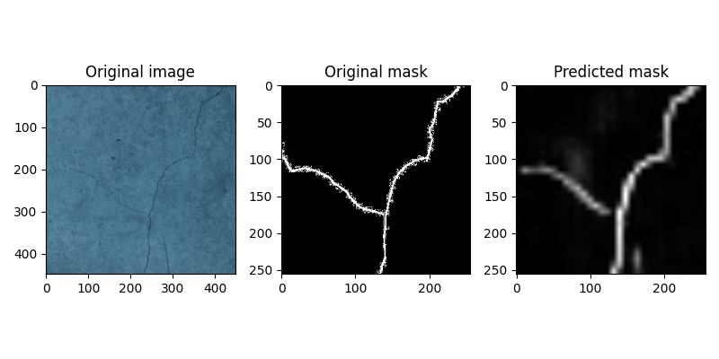
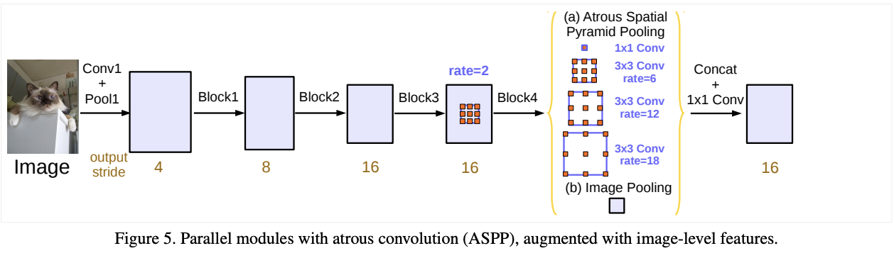

# 1. segmentation train

python crack_segmentation.py

result is 'seg_model.pth'

# 2. segmentation inference

python evaluation.py

result is folder and result image that real_images/*.png

# 정성적 평가 

# 정량적 평가 

완성하지 못했습니다.

# [Question]

1) 제안한 모델(들)을 사용한 이유와 근거를 간략히 적어주세요.

DeepLab v3에서는 multi-scale contextual feature를 학습할 수 있도록 구조를 설계하였습니다.
DeepLab v3에서는 feature extractor로써 ImageNet pre-trained 된 ResNet을 사용합니다. 차이점은 ResNet 마지막 부분에 단순히 convolution으로 끝나는 것이 아니라 atrous convolution을 사용한다는 점입니다. 이 각각의 atroud convolution의 dilation을 다르게 적용하여 multi-scale context를 학습하는 데 그 목적이 있습니다.
이 모델의 가장 중요한 3가지 부분을 아래에서 간략하게 설명드리겠습니다.

## ResNet

DeepLab v3에서 사용되는 ResNet의 형태는 Batch Nomalization, ReLU, weight를 한 블록으로 하여, 두 번 반복 구조로 구성되어 있습니다. 

## Atroud Convolution

Atrous(diliated) convolution은 기본적인 convolution layer에서 filter의 FOV (Field Of View)를 늘리기 위하여 필터 window 내부적으로 간격을 띄운 형태를 의미합니다.

## Atrous Spatial Pyramid Pooling

DeepLab v3에서는 이와 같은 Atrous Convolution의 개념과 Output Stride라는 개념을 이용하여 ASPP라는 모듈을 만들어 사용합니다. ASPP는 Atrous Convolution을 Multi-Scale로 적용하는 것이 핵심으로 다양한 dilation rate의 convolution을 parallel 하게 사용하여 Multi-Scale의 FOV를 가질 수 있도록 합니다.

2) 성능을 향상시키기 위해 노력했다면, 그 내용과 근거를 간략히 적어주세요.

성능 향상을 위한 모델 변경은 적용하지 않았습니다.

3) 결과에 대한 본인의 해석을 간략히 적어주세요.

정상적 결과로 판단했을 때, 예측 이미지가 GT 이미지와 비교시, 전체적인 크랙의 양상은 비슷하게 예측되었으나, 트레이닝에서 데이터 증강 시, 가우시안 블러를 통해 엣지를 뭉갠 것이 예측 이미지에서 블러 현상을 발생시켰다고 생각합니다.

정량적 결과는 아직 코드를 완성하지 못했습니다.

4) 만약 시간이 더 주어진다면 가장 시도해보고 싶은 것을 하나 제시하고 그 이유에 대해서 간략히 적어주세요.

정상적 결과에서 크랙인 부분과 크랙이 아닌 부분을 구분하여 색으로 표시하고 싶습니다.
